<div align="center">

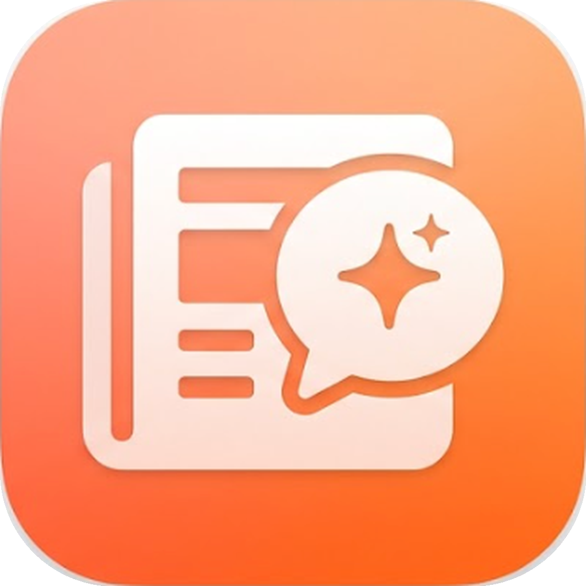

# Layman

### Business, Tech & Startups — Made Simple

An iOS news reader that takes complex business, tech, and startup news and explains it in plain, everyday language — in *layman's terms*.

🎥 **[Watch the App Demo Video here](https://drive.google.com/file/d/1fBPSz9OIOcq4wAUQOyyAlutHd1__50So/view?usp=sharing)**

Built with **SwiftUI** | Powered by **Groq AI** | Backed by **Supabase**

---

</div>

## About

Layman is a mobile-first news application designed to make business, technology, and startup news accessible to everyone. It leverages AI to break down complex articles into short, digestible summaries written in simple language. Users can read curated news feeds, save articles for later, and ask follow-up questions to an AI chatbot that responds in plain English.

The app supports both light and dark themes, voice-based interaction, reading streak tracking, and seamless cloud-synced bookmarking through Supabase.

---

## Screenshots

### Onboarding & Authentication

| Welcome Screen | Sign In | Sign Up |
|:---:|:---:|:---:|
| 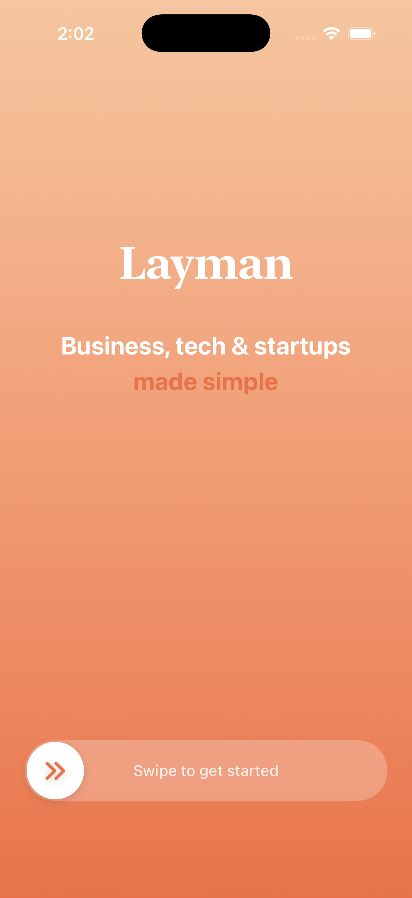 | 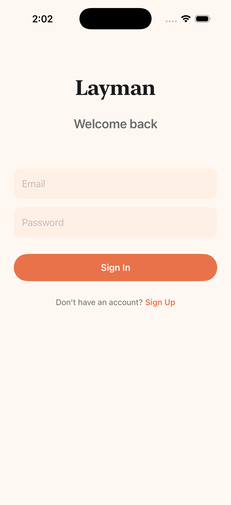 | 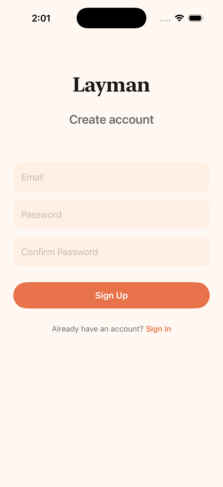 |

**Welcome Screen** — The entry point of the app. Features a warm peach-to-orange gradient background with the Layman logo and tagline. The words "made simple" are highlighted in the accent color. A swipe-to-start slider at the bottom triggers haptic feedback and navigates the user to authentication.

**Sign In** — Returning users can log in with their email and password. The clean, minimal form uses the app's warm color palette with rounded input fields and a prominent Sign In button. A link to the Sign Up screen is provided for new users.

**Sign Up** — New users can create an account with email, password, and password confirmation. The form follows the same visual language as the Sign In screen. Authentication is handled securely through Supabase.

---

### Home Feed

| Home (Light Mode) | Home (Dark Mode) | Search |
|:---:|:---:|:---:|
| 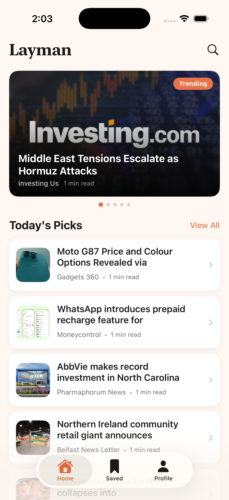 | 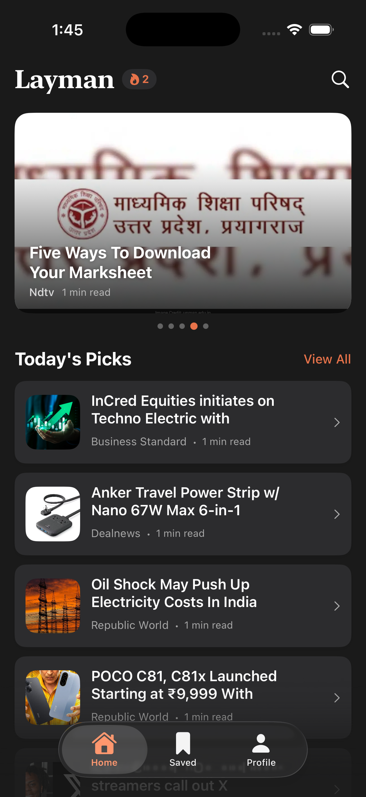 | 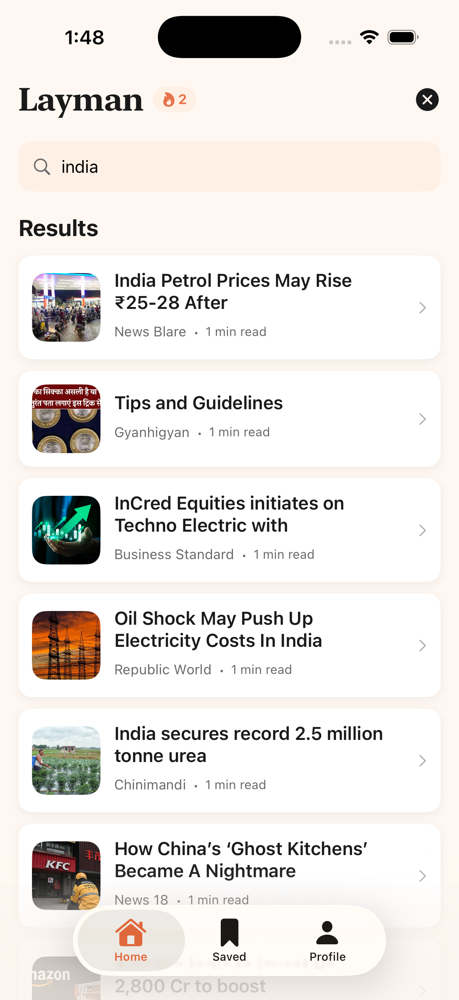 |

**Home (Light Mode)** — The main news feed displays a horizontally swipeable featured carousel at the top with full-bleed article images and headline overlays. A "Trending" badge highlights popular articles. Below, the "Today's Picks" section lists articles with thumbnails, source names, and estimated read times. A search icon in the top-right corner opens the search interface.

**Home (Dark Mode)** — The same Home feed rendered in the app's dark theme. All elements adapt automatically — background shifts to deep black, cards use dark surfaces, and text switches to light tones. The reading streak badge and tab bar also adapt to the dark color palette.

**Search** — The search interface allows users to filter articles by keyword in real time. Results are displayed in the same card format as the main feed, showing thumbnails, headlines, source names, and read times. The search works across both the Home and Saved screens.

---

### Article Detail

| Article Detail (Light) | Article Detail (Dark) | Saved Toast |
|:---:|:---:|:---:|
| 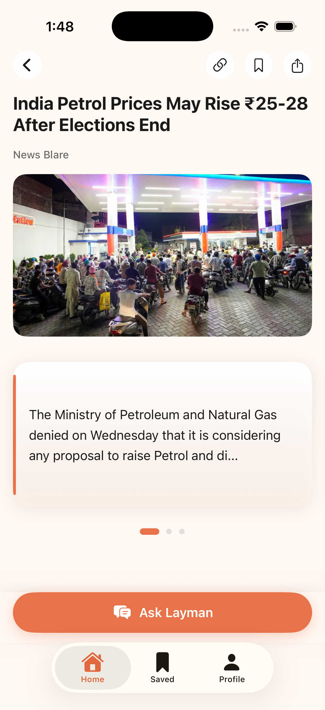 |  |  |

**Article Detail (Light Mode)** — Tapping an article opens the full detail view. The screen displays a bold two-line headline, source attribution, a full-width article image, and AI-generated content cards. Each article is summarized into three swipeable cards (28–35 words each) written in layman's terms. A page indicator tracks card progress. The top-right toolbar provides actions for opening the original article link, bookmarking, and sharing.

**Article Detail (Dark Mode)** — The detail view in dark theme. The content cards, header, and image adapt to the dark surface. The "Ask Layman" button at the bottom remains in the accent orange color for visibility and quick access to the AI chatbot.

**Article Saved** — When a user taps the bookmark icon, the article is saved to their Supabase-synced collection. An "Article saved!" toast confirmation appears at the bottom of the screen. The bookmark icon fills in to indicate the saved state.

---

### AI Chatbot — Ask Layman

| Ask Layman (Light) | Ask Layman (Dark) |
|:---:|:---:|
| 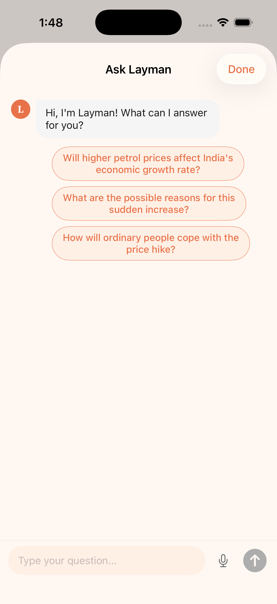 | 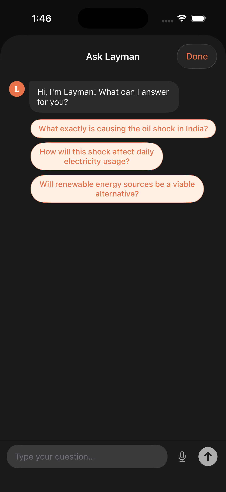 |

**Ask Layman (Light Mode)** — The AI chatbot opens as a sheet from the article detail view. The bot greets the user and presents three auto-generated question suggestions based on the article's content. Users can tap a suggestion or type their own question. A microphone icon enables voice input via Apple's Speech framework (real device only).

**Ask Layman (Dark Mode)** — The same chatbot interface in dark theme. The suggestion chips use a soft peach-on-dark contrast for readability, while the bot's avatar and input field adapt to the dark surface.

| Chat Response (Light) | Chat Response (Dark) |
|:---:|:---:|
| 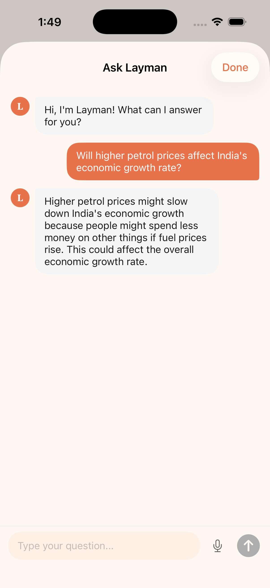 | 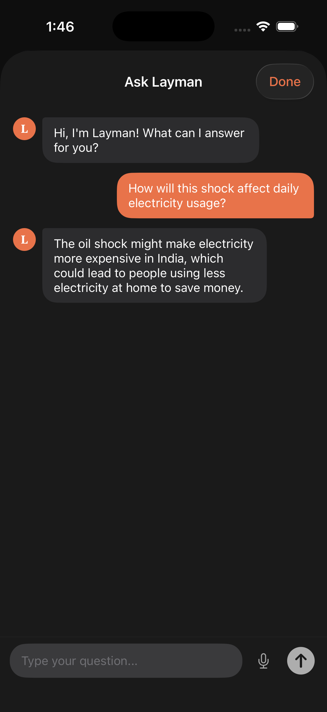 |

**Chat Response (Light Mode)** — After a user taps a suggestion or submits a question, the AI responds in 1–2 sentences using simple, everyday language. The conversation follows a clean bubble layout with distinct colors for user messages (orange) and bot responses (gray/light). The Groq API (LLaMA 3.1 8B Instant) powers all responses.

**Chat Response (Dark Mode)** — The same conversation rendered in dark theme. User messages appear in the accent orange, while bot responses use dark surface bubbles with light text for contrast.

---

### Saved Articles

| Saved Articles (Light) | Saved Articles (Dark) | Swipe to Delete |
|:---:|:---:|:---:|
| 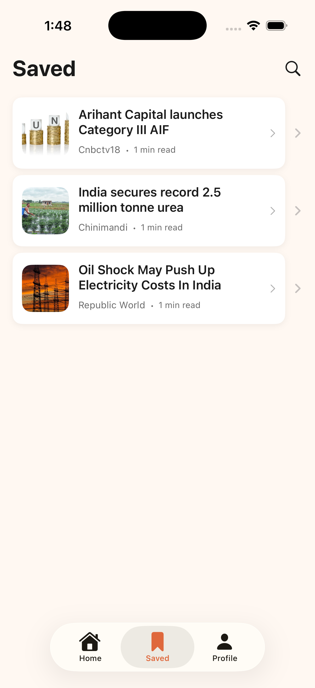 | 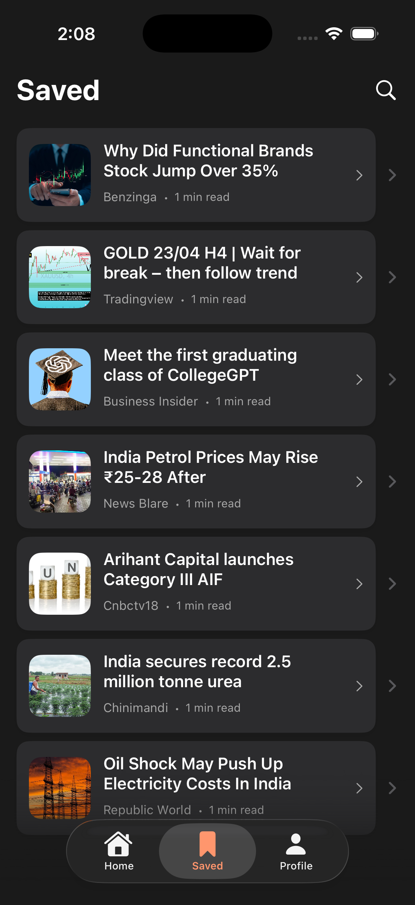 | 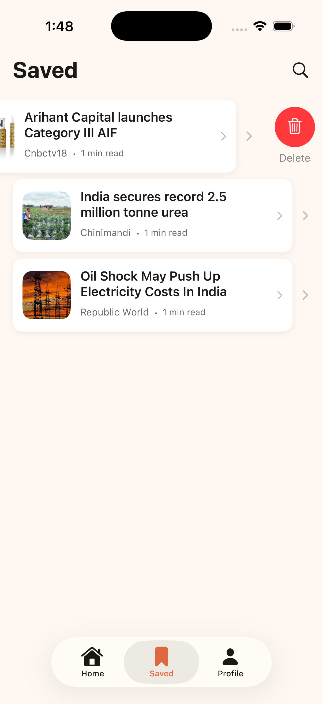 |

**Saved (Light Mode)** — The Saved tab displays all bookmarked articles in a clean list format with thumbnails, headlines, source names, and read times. Articles are synced to Supabase with Row Level Security, ensuring each user can only access their own saved collection. A search icon at the top allows filtering saved articles.

**Saved (Dark Mode)** — The Saved screen rendered in dark theme. The card backgrounds shift to dark surfaces, and all text adapts to light tones for readability.

**Swipe to Delete** — Users can swipe left on any saved article to reveal a delete action. Tapping the red delete button removes the article from both the local state and the Supabase database. The list updates immediately with a smooth animation.

---

### Profile & Settings

| Profile (Light) | Profile (Dark) | Support Section |
|:---:|:---:|:---:|
| 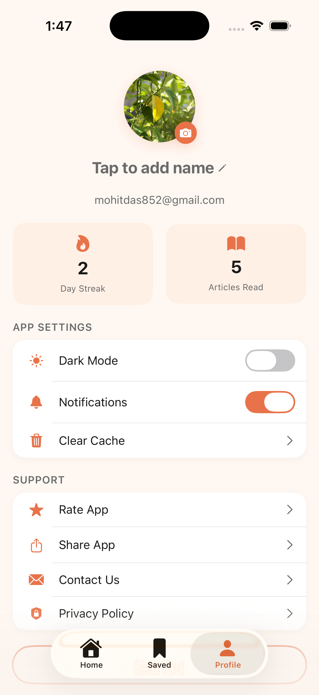 | 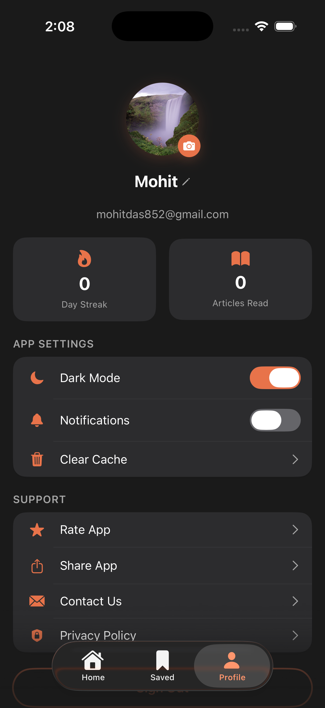 | 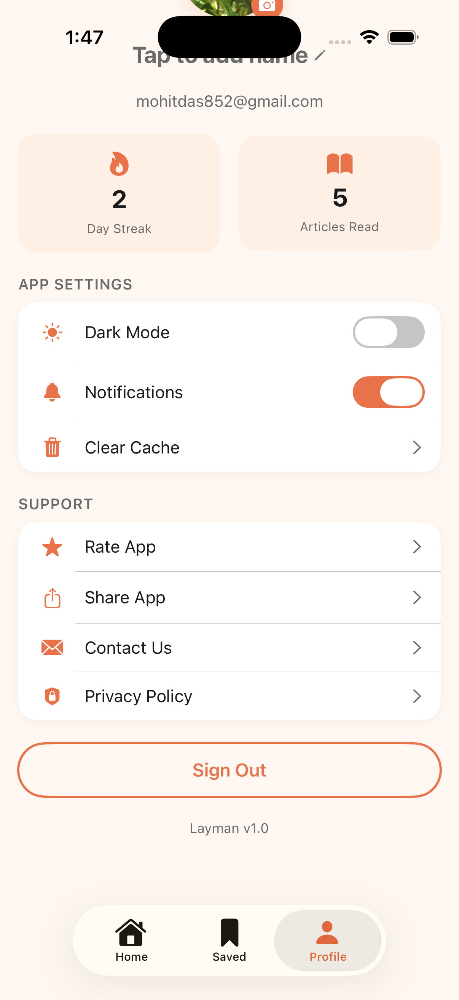 |

**Profile (Light Mode)** — The Profile tab shows the user's avatar (tappable to change photo), display name (editable), and email address. Two stat cards display the current reading streak (consecutive days) and total articles read. Below, the App Settings section includes toggles for Dark Mode and Notifications, along with a Clear Cache option.

**Profile (Dark Mode)** — The full profile view in dark theme. The stat cards, settings toggles, and support links all adapt to the dark color scheme. The dark mode toggle is shown in its active state.

**Profile — Support Section** — Scrolling down reveals the Support section with Rate App, Share App, Contact Us, and Privacy Policy options. A prominent Sign Out button and the app version number are displayed at the bottom.

---

## Features

### Core
- **Simplified News** — Real articles from NewsData.io with headlines cleaned and capped at approximately 50 characters for casual readability
- **AI Content Cards** — Each article is summarized into 3 swipeable cards (28–35 words each) by Groq AI, written in layman's terms
- **Ask Layman Chatbot** — Context-aware AI chat powered by Groq (LLaMA 3.1 8B Instant) that responds in 1–2 sentence answers using simple language
- **Auto-generated Suggestions** — 3 tappable question chips generated per article for quick exploration
- **Save and Bookmark** — Articles synced to Supabase with Row Level Security; save and unsave with animated feedback
- **Search** — Filter articles by keyword on both Home and Saved screens

### Authentication
- Email/password sign-up and login via Supabase Auth
- Persistent session management across app launches with auto-restore on open
- Auth state listener keeps the session in sync throughout the app
- Basic validation and error handling on all auth forms

### UI and Design
- **Welcome Screen** — Warm peach-to-orange gradient, animated logo reveal, swipe-to-start slider with haptic feedback
- **Featured Carousel** — Horizontal swipeable cards with full-bleed images and headline overlays, page indicator dots
- **Today's Picks** — Vertical scrollable list with rounded thumbnails and headline text
- **Article Detail** — Bold headline, full-width image, 3 swipeable AI-generated content cards with 3D rotation animations
- **In-app Browser** — Original article opens in a WebView sheet without leaving the app
- **Tab Bar** — Home, Saved, and Profile with smooth navigation
- **Dark Mode** — Full dark mode support with an adaptive color palette across all screens
- **Haptic Feedback** — Tactile feedback on bookmark, dark mode toggle, swipe-to-start, and other interactions

### Bonus Features
- **Voice Input** — Speech-to-text in the chatbot using Apple's Speech framework (real device only)
- **Reading Streaks** — Daily streak counter tracking consecutive reading days
- **Articles Read Counter** — Tracks unique articles opened with deduplication via stored IDs
- **Automated Unit Tests** — XCTest suite generated for Core Models and decoding logic
- **Real-time Sync** — Saved articles sync instantly across devices using Supabase Realtime channels
- **Database as Code** — Supabase CLI setup with SQL migrations for schema and RLS policies
- **Offline Reading** — Articles cached in UserDefaults for offline access
- **Reading Time Estimates** — Estimated read time displayed per article
- **Pagination** — Infinite scroll with automatic next-page loading
- **Pull to Refresh** — Swipe down to reload the latest articles
- **Profile Photo** — Pick a photo from the device library for the profile avatar
- **Dark Mode Toggle** — Manual dark/light mode switch in Profile settings
- **Notifications Toggle** — Notification preference setting in Profile
- **Clear Cache** — Clear cached articles and reset read count from Profile
- **Rate App / Share App** — Quick actions in the Profile support section

---

## Tech Stack

| Layer | Technology |
|-------|-----------|
| **UI** | SwiftUI (iOS 17+) |
| **Architecture** | MVVM with `@Observable` ViewModels |
| **Auth & Database** | Supabase (Email/Password Auth + PostgreSQL with RLS) |
| **News API** | [NewsData.io](https://newsdata.io) — business and technology categories |
| **AI Chat & Summaries** | [Groq API](https://console.groq.com) — LLaMA 3.1 8B Instant |
| **Voice Input** | Apple Speech Framework (SFSpeechRecognizer) |
| **Package Manager** | Swift Package Manager |
| **Dependency** | [supabase-swift](https://github.com/supabase/supabase-swift) |

---

## Project Architecture

### Data Flow Diagram

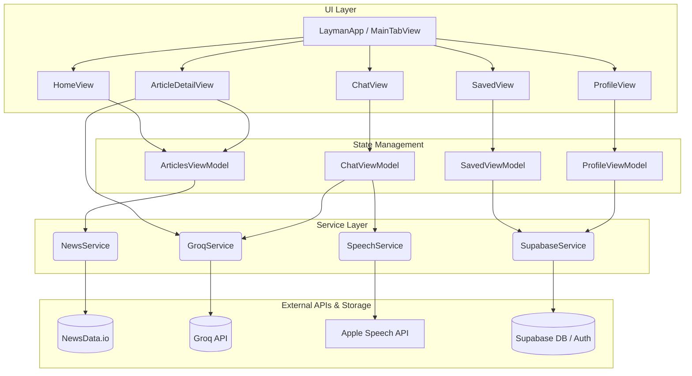

### Folder Structure

```text
Layman/
├── LaymanApp.swift                     # App entry point, auth state routing
├── Config/
│   └── AppConfig.swift                 # Loads API keys from Info.plist (via xcconfig)
├── Models/
│   ├── Article.swift                   # News article model + layman headline generator
│   ├── ChatMessage.swift               # Chat message model (user/bot)
│   └── SavedArticle.swift              # Supabase saved article models
├── ViewModels/
│   ├── AuthViewModel.swift             # Auth state + Supabase auth listener
│   ├── ArticlesViewModel.swift         # News feed, pagination, search, caching
│   ├── ChatViewModel.swift             # Chat UI state + Groq API integration
│   ├── SavedViewModel.swift            # Saved articles state + Supabase sync
│   └── ProfileViewModel.swift          # User profile state
├── Views/
│   ├── WelcomeView.swift               # Onboarding with swipe-to-start
│   ├── AuthView.swift                  # Login / Sign-up screen
│   ├── MainTabView.swift               # Tab navigation (Home | Saved | Profile)
│   ├── Home/
│   │   ├── HomeView.swift              # Main feed with carousel + today's picks
│   │   ├── FeaturedCarousel.swift       # Horizontal image carousel
│   │   └── ArticleRow.swift            # Article row with thumbnail
│   ├── Detail/
│   │   ├── ArticleDetailView.swift     # Article detail + content cards + bookmark
│   │   ├── ContentCard.swift           # Swipeable summary card component
│   │   └── WebViewSheet.swift          # In-app browser for original article
│   ├── Chat/
│   │   ├── ChatView.swift              # AI chatbot UI + voice input
│   │   ├── ChatBubble.swift            # Chat message bubble component
│   │   └── SuggestionChip.swift        # Tappable question chip
│   ├── Saved/
│   │   └── SavedView.swift             # Bookmarked articles list
│   └── Profile/
│       └── ProfileView.swift           # User profile, stats, settings, sign out
├── Services/
│   ├── SupabaseService.swift           # Auth + saved articles CRUD
│   ├── NewsService.swift               # NewsData.io API client with pagination
│   ├── GroqService.swift               # AI chat, content cards, question suggestions
│   └── SpeechService.swift             # Speech-to-text (Apple Speech framework)
└── Utilities/
    ├── Constants.swift                 # Color palette (light + dark), design tokens
    └── Extensions.swift                # View helper extensions
```

---

## Setup Instructions

### Prerequisites

- **Xcode 15+** (or Xcode 26 beta)
- **iOS 17+** device or simulator
- Free accounts on: [Supabase](https://supabase.com), [NewsData.io](https://newsdata.io), [Groq](https://console.groq.com)

### 1. Clone the Repository

```bash
git clone https://github.com/MOHITKOURAV01/LaymanNews.git
cd LaymanNews
```

### 2. Configure API Keys

Create a `Secrets.xcconfig` file in the project root (this file is not tracked by git):

```xcconfig
// Secrets.xcconfig
// API keys — DO NOT commit this file to git

SUPABASE_URL = https:/$()/your-project.supabase.co
SUPABASE_ANON_KEY = your_supabase_anon_key
NEWS_API_KEY = your_newsdata_api_key
GROQ_API_KEY = your_groq_api_key
```

> **Important:** Use `https:/$()/` instead of `https://` in xcconfig files — the `$()` prevents `//` from being treated as a comment by Xcode.

### 3. Supabase Setup

1. Create a free project at [supabase.com](https://supabase.com)
2. Go to **Authentication > Providers** and enable **Email/Password** (disable email confirmation for development)
3. Open the **SQL Editor** and run:

```sql
-- Create saved articles table
CREATE TABLE saved_articles (
  id UUID DEFAULT gen_random_uuid() PRIMARY KEY,
  user_id UUID REFERENCES auth.users(id) ON DELETE CASCADE,
  article_id TEXT NOT NULL,
  title TEXT NOT NULL,
  description TEXT,
  image_url TEXT,
  source_url TEXT,
  source_name TEXT,
  published_at TIMESTAMPTZ,
  content TEXT,
  created_at TIMESTAMPTZ DEFAULT NOW(),
  UNIQUE(user_id, article_id)
);

-- Enable Row Level Security
ALTER TABLE saved_articles ENABLE ROW LEVEL SECURITY;

-- Users can only read their own saved articles
CREATE POLICY "Users can read own saved articles" ON saved_articles
  FOR SELECT USING (auth.uid() = user_id);

-- Users can only insert their own saved articles
CREATE POLICY "Users can insert own saved articles" ON saved_articles
  FOR INSERT WITH CHECK (auth.uid() = user_id);

-- Users can only delete their own saved articles
CREATE POLICY "Users can delete own saved articles" ON saved_articles
  FOR DELETE USING (auth.uid() = user_id);
```

### 4. Build and Run

1. Open `Layman.xcodeproj` in Xcode
2. Wait for Swift Package Manager to resolve the `supabase-swift` dependency
3. Select an iPhone simulator (iOS 17+)
4. Press **Cmd + R** to build and run

> **Note:** Voice input (microphone) requires a physical iOS device — it is not available on the Simulator.

---

## API Keys Reference

| Key | Source | Free Tier |
|-----|--------|-----------|
| `SUPABASE_URL` | [Supabase Dashboard](https://supabase.com) — Project Settings — API | Yes |
| `SUPABASE_ANON_KEY` | [Supabase Dashboard](https://supabase.com) — Project Settings — API | Yes |
| `NEWS_API_KEY` | [NewsData.io](https://newsdata.io) — Dashboard — API Key | Yes |
| `GROQ_API_KEY` | [Groq Console](https://console.groq.com) — API Keys | Yes |

All keys are loaded at runtime through `Info.plist` > `Secrets.xcconfig`, keeping credentials out of source code.

---

## Key Design Decisions

| Decision | Rationale |
|----------|-----------|
| **`@Observable` ViewModels** | Modern Swift Observation framework for clean, minimal boilerplate state management |
| **Synchronous `getCurrentUserId()`** | Uses `client.auth.currentUser?.id` (sync) for fast access without async overhead |
| **Auth state listener** | `authStateChanges` AsyncStream ensures auth stays in sync across all screens |
| **Article deduplication** | Read article IDs stored as a JSON-encoded `Set<String>` in UserDefaults |
| **Reading streak tracking** | Tracked per unique article read, not per app open — prevents gaming |
| **Content card fallback** | If Groq AI fails, static fallback cards are generated from article content |
| **Offline caching** | Full article list cached as JSON in UserDefaults for instant offline access |
| **Secure credentials** | API keys loaded via xcconfig > Info.plist > `Bundle.main.infoDictionary` (never hardcoded) |

---

## AI Development Workflow

This app was built using **Antigravity** (Google DeepMind) as the primary AI coding assistant. The entire development process — architecture, API integrations, UI implementation, and debugging — was driven through AI-assisted prompting and iteration.

The AI context file (`CLAUDE.md`) is included in the repository root. It contains the full project context, architecture guidelines, design system specifications, and implementation details that guided the AI throughout development.

**Key areas where AI assisted:**
- MVVM architecture setup and SwiftUI view composition
- Supabase authentication flow with async auth state listener pattern
- Groq API integration for chat, content card generation, and question suggestions
- Speech-to-text integration using Apple's Speech framework
- Dark mode support with adaptive color system
- Reading streak and stats tracking logic
- Article deduplication, filtering, and pagination
- Content card 3D rotation animations and haptic feedback patterns
- Error handling with retry logic for save operations

---

## License

MIT
